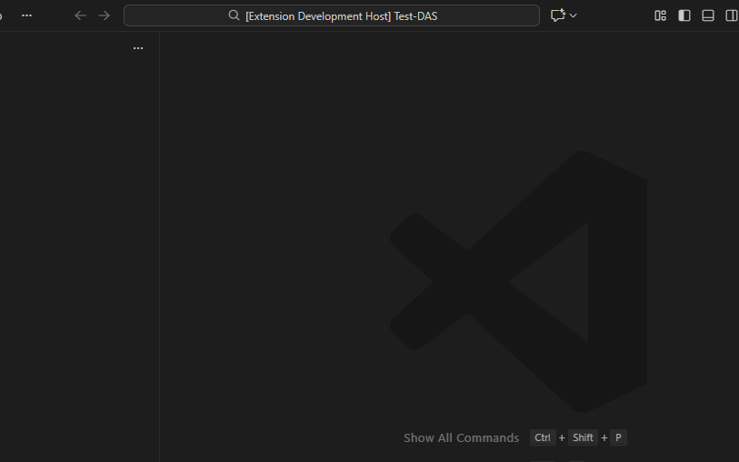

# Docs-as-System VS Code Extension 

An extension that generates a complete Docs-as-System project for you, including templates, configuration files and Git scripts, directly from within VS Code.



## What does it do?

The extension creates a fully structured project that includes:

• **`docs/` folder** with ready to use document templates (planning, architecture, automation, logs)  
• **`src/` folder** for your source code  
• **Git scripts** for managing branches, commits and pull requests  
• **Configuration files** (.gitignore, .editorconfig, .gitattributes)  
• **CHANGELOG.md** for tracking changes

**Designed specifically for working with AI Agents.**

---

## How to use it?

### Step 1: Installation
Install the extension from the VS Code Marketplace (you probably arrived here through the search).

### Step 2: Create a new project

1. Open VS Code in the folder where you want the project to be created (an empty folder works too)

2. Press **Ctrl+Shift+P** (or **Cmd+Shift+P** on macOS) to open the Command Palette

3. Type: **`Docs-as-System: Create New Docs-as-System Project`**

4. Enter a name for the new project

5. Done. Your project is created with the full structure and templates

---

## What do you get?

The generated project includes:

• A complete, standardized folder structure  
• Document templates following the methodology  
• Git scripts ready to use  
• Basic configuration files  
• CHANGELOG and Implementation Guide  

Project structure:


```
my-project/
├── 📁 docs/
│ ├── 📁 agent/ # AI agent configuration and operational policies
│ ├── 📁 architecture/ # Architecture planning and design decisions
│ ├── 📁 automation/ # Workflows, guardrails, prompts
│ ├── 📁 logs/ # Execution logs and documentation
│ ├── 📁 planning/ # Business requirements, spec, work plan
│ └── 📁 project/ # Project overview and general documentation
├── 📁 src/ # Your source code
├── 📁 automation/git/ # Git management scripts
├── 📄 CHANGELOG.md
├── 📄 PROJECT_IMPLEMENTATION_GUIDE.md
└── Configuration files (.gitignore, .editorconfig, etc.)
```
---

## Ideal for:

• Developers working with AI Agents (GitHub Copilot, ChatGPT, Claude, etc.)  
• Teams that want structured documentation from day one  
• Project managers who need a consistent methodology from planning to execution  
• Anyone who wants to manage a project in a clear and organized way

---

## Useful links

- **Methodology website:**  
  https://tomkedem.github.io/Docs-as-System/

- **GitHub repository:**  
  https://github.com/tomkedem/docs-as-system-vscode-extension

- **Report issues:**  
  https://github.com/tomkedem/docs-as-system-vscode-extension/issues

---

## License

MIT License – free to use, modify and distribute.

---

**Created by Tomer Kedem**
